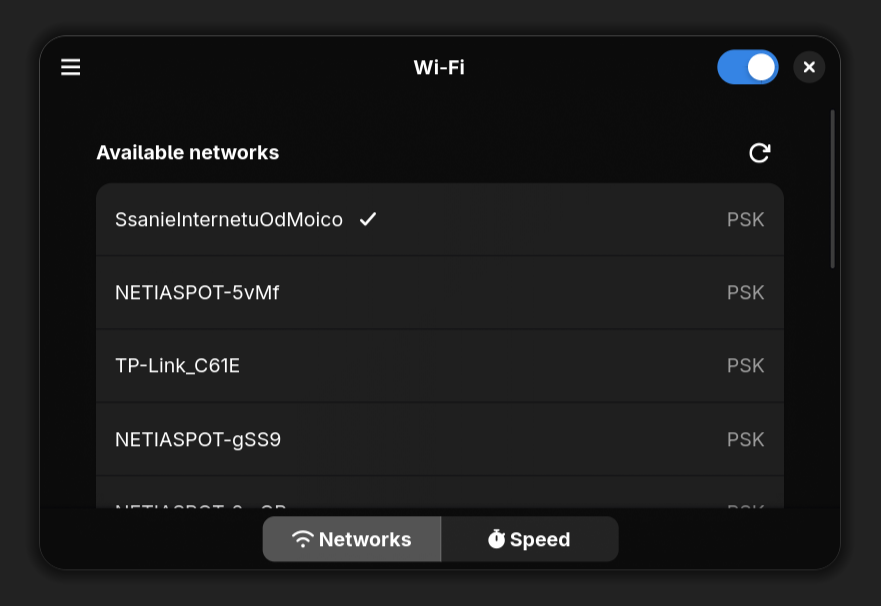
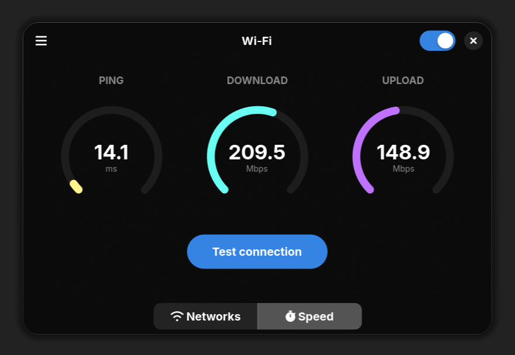

# Adwifi

Adwifi is a [libadwaita](https://github.com/GNOME/libadwaita) Wi-Fi management app designed for [veri](https://github.com/rzesm/veri) but suitable for any other Arch Linux setup. It interfaces [iwd](https://wiki.archlinux.org/title/Iwd) directly and doesn't rely on [NetworkManager](https://wiki.archlinux.org/title/NetworkManager), making it ideal for minimal configurations.

Adwifi was inspired by [Adwaita Bluetooth](https://github.com/ezratweaver/adw-bluetooth/)'s aesthetic.

The project is work in progress and not extensively tested. I do not advise relying on it as your only Wi-Fi manager.

### Features

- Explicit network adapter selection
- Support for all standard network security protocols
- Connection speed tester

### Interface



### Installation

#### AUR
Working on it c:

#### Manual
```
git clone https://github.com/rzesm/adwifi
cd adwifi
makepkg -si
```